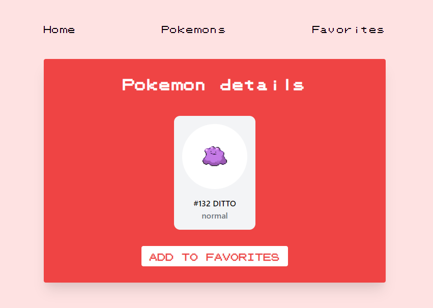

# Pokedex

This is a homework assignment from the Frontend Developer bootcamp at InfoShare Academy. The task included:

- fetching and displaying the list of pokemons from PokeApi
- creating a detailed pokemon card view
- saving pokemons in localStorage and displaying the saved cards
- creating components
- creating routes
- handling states

App built with:

- React v17
- React Router v5
- React Hooks
- Tailwind CSS
- PokeApi: https://pokeapi.co/api/v2/

## Live site:

[https://double-vee.github.io/pokedex](https://double-vee.github.io/pokedex)

## Screenshots:

<figure>
  <figcaption>
    
Favorites:

  </figcaption>
  
</figure>

<figure>
  <figcaption>
    
Details:

  </figcaption>
  
</figure>

<figure>
  <figcaption>
    
List:

  </figcaption>
  
</figure>

## To run the app in the development mode:

1. Clone the repo
2. In the project directory, run `npm i && npm start`
